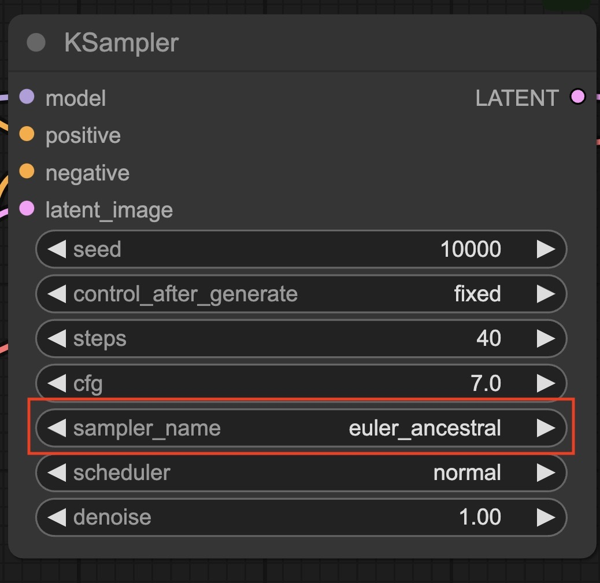

AniMemory-alpha Custom Node for [ComfyUI](https://github.com/comfyanonymous/ComfyUI)  

## model

- You can find the model weights [here](https://huggingface.co/animEEEmpire/AniMemory-alpha/blob/main/animemory_alpha.safetensors). 
- Put the animemory_alpha.safetensors file in your: ComfyUI/models/checkpoints/ folder.

## Instalation:

- Navigate to the `/ComfyUI/custom_nodes/` folder
- `git clone https://github.com/animEEEmpire/ComfyUI-Animemory-Loader`
- Start ComfyUI

## Workflow:

- [Workflow json](./example/animemory_demo.json)
- You can then load or drag the following [image](./example/demo.png) in ComfyUI to get the workflow: 
- Special Notes: The sampler_name in KSaplmer only can be work with euler_ancestral

   

